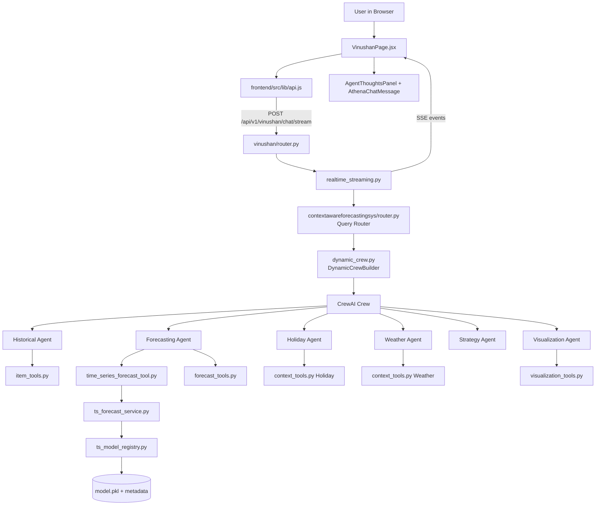
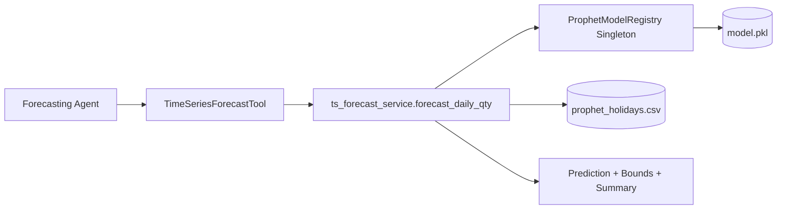

# ATHENA Subsystem Architecture (Vinushan)

## 1) Purpose and Scope

This document describes the **high-level architecture** of Vinushan's subsystem (`backend/app/modules/vinushan`) named **ATHENA** (Context-Aware Forecasting and Decision Support System).

It focuses on:
- End-to-end request flow from UI to AI response
- Internal backend architecture (routing, streaming, orchestration, tools, forecasting)
- Data and model dependencies
- Key interfaces and extension points

Out of scope:
- Other team modules (`vishva`, `nandika`, `ayathma`)
- Low-level CSS/UI styling details
- Deployment/infra hardening details

---

## 2) System Context

ATHENA is one module inside a shared RP monorepo with one combined frontend and one combined backend.

- **Frontend route**: `/vinushan`
- **Backend API prefix**: `/api/v1/vinushan`
- **Primary interaction mode**: real-time streaming chat via SSE

### External dependencies
- OpenAI Chat models (`gpt-4o-mini`) for routing + agent reasoning
- OpenAI TTS (`tts-1`) for voice playback
- CrewAI for multi-agent orchestration
- Prophet model artifact stored on disk (`models/prophet_qty/v1/model.pkl`)

---

## 3) High-Level Component View

---

## 4) Layered Architecture

ATHENA follows a layered approach:

### Layer A — Presentation (Frontend)
**Key files**
- `frontend/src/modules/vinushan/VinushanPage.jsx`
- `frontend/src/modules/vinushan/components/AthenaChatMessage.jsx`
- `frontend/src/modules/vinushan/components/AgentThoughtsPanel.jsx`
- `frontend/src/lib/api.js`

**Responsibilities**
- Capture user questions
- Maintain conversation history (localStorage)
- Open streaming request and consume SSE events
- Render live reasoning timeline and final response
- Render chart payloads in chat
- Trigger TTS and export actions

---

### Layer B — API Gateway (Module Router)
**Key file**
- `backend/app/modules/vinushan/router.py`

**Responsibilities**
- Expose module endpoints (`/ping`, `/chat`, `/chat/stream`, `/tts`, settings/report endpoints)
- Delegate chat processing to service layer (`chat_service`, `realtime_streaming`)
- Standardize HTTP responses and errors

---

### Layer C — Orchestration and Streaming
**Key files**
- `contextawareforecastingsys/api/realtime_streaming.py`
- `contextawareforecastingsys/router.py`
- `contextawareforecastingsys/dynamic_crew.py`

**Responsibilities**
- Parse question and infer temporal context (month/year)
- Route query to relevant agent set
- Build dynamic CrewAI execution graph for this request
- Execute sequence and emit event stream (`run_start`, `query_analysis`, `agent_start`, `tool_start`, `tool_result`, `agent_end`, `run_end`, `error`)

---

### Layer D — Intelligence/Tooling
**Key files**
- `contextawareforecastingsys/tools/*.py`

**Responsibilities**
- Encapsulate data access and analytics primitives as tools
- Provide deterministic calculations for agents
- Provide chart JSON payload generation

---

### Layer E — Forecasting and Model Runtime
**Key files**
- `contextawareforecastingsys/services/ts_forecast_service.py`
- `contextawareforecastingsys/services/ts_model_registry.py`

**Responsibilities**
- Build forecast input frame with calendar + weather + holiday regressors
- Run Prophet inference for requested horizon/date range
- Provide confidence bounds and summary statistics
- Load and cache trained model artifact via singleton registry

---

### Layer F — Data and Artifacts
**Key locations**
- `data/processed/athena_daily_ts_dataset.csv`
- `data/processed/prophet_holidays.csv`
- `models/prophet_qty/v1/*`
- `knowledge/user_preference.txt`

**Responsibilities**
- Persist historical transactional/contextual data
- Persist model binary and metadata
- Provide static context for personalization/preferences

---

## 5) Request Lifecycle (Primary Path: Streaming Chat)

1. User submits message on `VinushanPage`.
2. Frontend calls `streamVinushanChat()` in `frontend/src/lib/api.js`.
3. Request hits `POST /api/v1/vinushan/chat/stream`.
4. `router.py` delegates to `stream_chat_realtime()`.
5. Streaming service emits `run_start` immediately.
6. `route_question()` analyzes intent and returns:
   - `agents_needed`
   - routing reasoning
   - flags (`is_conversational`, `needs_visualization`, etc.)
7. `DynamicCrewBuilder` assembles only required agents/tasks.
8. Crew executes tasks (sequential process).
9. Agents invoke tools; results are surfaced as streaming events.
10. Final synthesized answer (+ optional charts) emitted in `run_end`.
11. Frontend appends assistant message and renders charts/reasoning timeline.

---

## 6) Query Routing Architecture

**Routing mechanism:** LLM-guided router (`gpt-4o-mini`) with capability taxonomy.

Capabilities mapped in `AGENT_CAPABILITIES` include:
- `historical`
- `forecasting`
- `holiday`
- `weather`
- `strategy`
- `visualization`

### Routing decisions produced
- `agents_needed`: minimal required specialists
- `is_comprehensive`: if synthesis/planning is required
- `is_conversational`: if small-talk/no analytics needed
- visualization-focused logic (chart requests)

This design avoids over-execution and keeps latency/cost reasonable.

---

## 7) Dynamic Multi-Agent Orchestration

`DynamicCrewBuilder` constructs agents and tasks at runtime.

### Agent set
- Historical Analyst
- Forecasting Specialist
- Holiday Analyst
- Weather Analyst
- Strategy Advisor
- Visualization Specialist

### Orchestration strategy
- **Process mode**: sequential
- **Rationale**: downstream agents (especially strategy) depend on previous outputs
- **Tool isolation**: each agent receives only relevant toolset, improving safety and precision

---

## 8) Forecasting Sub-Architecture

### Core idea
Forecasting is implemented as a dedicated service abstraction behind a CrewAI tool wrapper.

### Prediction pipeline
1. Resolve forecast period (`horizon_days` or `start_date/end_date`).
2. Build future regressor dataframe:
   - weekend flags
   - holiday/pre/post-holiday flags
   - monthly weather defaults
   - optional what-if overrides (`context_overrides`)
3. Invoke Prophet `predict()`.
4. Return per-day `yhat`, `yhat_lower`, `yhat_upper` + summary:
   - total_qty
   - avg_daily_qty
   - busiest_days
   - uncertainty note

### Reliability pattern
- `ProphetModelRegistry` singleton loads once and reuses model for all requests.
- If model unavailable, service returns structured error object rather than crashing the API.

---

## 9) Real-Time Event Streaming Architecture

Streaming is implemented with **Server-Sent Events (SSE)** for unidirectional low-overhead progress updates.

### Event categories
- Lifecycle: `run_start`, `run_end`, `error`
- Routing: `query_analysis`, `router_thought`
- Agent flow: `agent_start`, `agent_thought`, `agent_query`, `agent_self_check`, `agent_result_snapshot`, `agent_output`, `agent_end`
- Tool flow: `tool_start`, `tool_result`

### Why SSE fits ATHENA
- Native browser support
- Simpler than websocket for server-to-client stream
- Good fit for ordered timeline updates
- Easy event parsing in `streamVinushanChat()`

---

## 10) API Surface (Subsystem-Relevant)

### Core conversational endpoints
- `GET /api/v1/vinushan/ping`
- `POST /api/v1/vinushan/chat` (sync)
- `POST /api/v1/vinushan/chat/stream` (SSE, primary)
- `POST /api/v1/vinushan/tts`

### Additional business/report endpoints
- Email generation/settings and reporting endpoints are exposed through the same router.
- These are adjacent capabilities, not part of the core streaming chat path.

---

## 11) Data Contracts (Conceptual)

### Chat request
- `message: string`
- `conversation_history: [{ role, content, timestamp }]`

### Streaming event envelope
- `type`
- `run_id`
- `timestamp`
- optional `agent`, `task`, `content`, `data`

### Final run payload (`run_end`)
- `response`: final natural-language answer
- `charts`: chart data payloads for frontend rendering
- optional reasoning metadata

---

## 12) Design Principles Used

1. **Selective intelligence activation**
   - Only needed agents execute per question.

2. **Tool-grounded generation**
   - Agents rely on deterministic tools for data-heavy answers.

3. **Transparent reasoning UX**
   - Users can see progression through live event timeline.

4. **Model/runtime separation**
   - Forecasting service and model registry are isolated from API/controller code.

5. **Module encapsulation**
   - Vinushan subsystem remains largely self-contained under one module path.

---

## 13) Extension Points

Recommended high-level extension points:

- **New domain agent**
  - Add capability in router + create agent/task in `dynamic_crew.py`.

- **New visualization type**
  - Add chart tool in `tools/visualization_tools.py` + parse/render on frontend.

- **Alternative model versions**
  - Add versioned artifact directory under `models/` and extend model registry selection.

- **Policy/personalization layer**
  - Use `knowledge/user_preference.txt` as prompt context injection for strategy formatting.

---

## 14) Key File Map (Quick Reference)

- Backend entry for module APIs:
  - `backend/app/modules/vinushan/router.py`

- Orchestration core:
  - `backend/app/modules/vinushan/contextawareforecastingsys/api/realtime_streaming.py`
  - `backend/app/modules/vinushan/contextawareforecastingsys/router.py`
  - `backend/app/modules/vinushan/contextawareforecastingsys/dynamic_crew.py`

- Forecast runtime:
  - `backend/app/modules/vinushan/contextawareforecastingsys/services/ts_forecast_service.py`
  - `backend/app/modules/vinushan/contextawareforecastingsys/services/ts_model_registry.py`

- Tools:
  - `backend/app/modules/vinushan/contextawareforecastingsys/tools/`

- Frontend integration:
  - `frontend/src/modules/vinushan/VinushanPage.jsx`
  - `frontend/src/lib/api.js`

---

## 15) Summary

ATHENA is architected as a **streaming, tool-grounded, multi-agent analytics subsystem**. The frontend provides a transparent real-time experience, while the backend combines LLM routing, dynamic CrewAI orchestration, and a versioned Prophet forecasting runtime. This architecture balances:

- flexibility (dynamic agent selection),
- explainability (event timeline),
- and practical forecasting reliability (model registry + deterministic tool layer).
